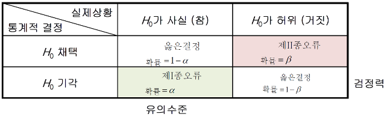

# INSIGHT 4주차 교육 세션: 통계

## 📌 목차
1. 기술 통계학과 추론 통계학
2. 수치 기술 통계 (기술 통계)
    - 중심 위치 척도
    - 변동성 척도 
    - 연관성 척도
3. 추론 통계 (모집단 분포 추정)
    - 확률 분포
    - 확률 분포 예시
4. 가설 검정
    - 가설 검정 절차
    - 1종 오류와 2종 오류
5. 조건부 확률과 베이즈 정리
    - 조건부 확률
    - 베이즈 정리

---

## 1. 기술 통계학과 추론 통계학
### 기술 통계학: Descriptive Statistics
: '현재 가지고 있는 데이터'를 기반으로 객관적인 사실만을 나타내는 통계
: 대표값(평균, 중앙값, 최빈값), 분산/표준편차, 극단치 등을 다룸
- 수치 기술 통계: 숫자 형태로 데이터 요약
- 표와 그래프 기술 통계: 표와 그래프 형태로 정보 시각화
### 추론 통계학: Inferential Statistics
:  표본의 통계량으로부터 모집단의 모수를 추론

## 2. 수치 기술 통계 (기술 통계)
### 중심 위치 척도
- 평균: mean (cf. 이상치에 민감)
- 중앙값: median (cf. 상대적으로 이상치에 민감 X)
- 최빈값: mode (cf. 일반적으로 범주형 데이터에 사용)

cf) 왜도: 데이터 분포의 비대칭성을 나타내는 통계적 지표

-> 평균, 중앙값, 최빈값을 통해 왜도 확인 가능

### 변동성 척도
- 사분위수(quartile): 데이터 표본을 네 개의 동일한 부분으로 나눈 값
- 사분위간 범위(IQR): 제3사분위수에서 제1분위수를 제외한 범위
- 범위(ranfe): 최대값과 최소값의 차이
- 분산(variance): 평균으로부터 얼마나 퍼져 있는지
- 표준편차(standard deviation): 분산의 제곱근
- 변동계수(coefficient of variation): 데이터의 상대적인 변동성

### 연관성
- 공분산(covariance): 두 변수가 각자의 평균으로부터 떨어진 값을 서로 곱한 후 평균한 값
- 상관계수(correlation): 두 변수 간의 선형 관계

## 3. 추론 통계 (모집단 분포 추정)
cf) 대수의 법칙: 표본의 크기가 커질수록 표본 평균이 모평균에 근사

cf) 중심극한정리: 표본의 크기가 크면 표본 평균의 분포과 모집단의 분포와 상관없이 정규 분포에 가까워짐

### 확률 분포
: 확률 변수가 특정한 값을 가질 확률

- 이산확률분포
- 연속확률분포

### 확률 분포 예시
- 정규분포
- T분포
- 카이제곱분포
- 이항분포 + 베르누이분포
- 포아송분포

## 가설 검정
### 가설 검정의 절차
1. 가설 설정
2. 유의 수준 설정
3. 검정통계량 산출
4. 가설 기각/채택 판단

### 1종 오류와 2종 오류
- 1종 오류: 귀무가설이 실제로 참이었는데 기각할 확률
- 2종 오류: 귀무가설이 실제로 거짓인데 채택할 확률

## 조건부 확률과 베이즈 정리
- 조건부 확률: 어떤 사건이 일어났을 때, 그와 연관된 다른 사건이 일어날 확률 = P(B∣A)
- 베이즈 정리: 두 확률 변수의 사전 확률과 사후 확률 사이의 관계를 나타내는 정리 = P(B∣A) = P(A∣B)P(B) / P(A)
​
 

