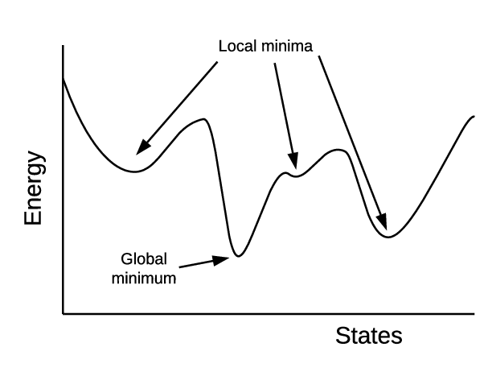
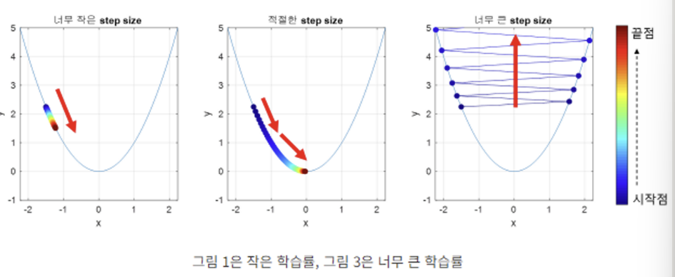

# INSIGHT 6주차 교육 세션: 회귀 심화, 실습

## 📌 목차
- 경사하강법
- 규제선형모델
- Scaling
- 차원축소

## 경사하강법
### 경사하강법의 정의
cost function의 현재 기울기 계산 

-> 기울기가 0이 되는 방향으로 진행 

-> 기울기가 0이 되면 최솟값

- 미분값: 점이 움직이는 '방향'을 결정
- Learning Rate(학습률): '얼만큼' 움직이는지 결정

    cf) 경사하강법의 ‘학습한다’ = ‘오차의 최솟값을 찾아나간다’

### 경사하강법의 문제점
#### Local Minima 문제

#### 적절한 step size를 찾지 못함

### 해결법
- 학습 도중에 학습률을 지속적으로 바꾸는 Adaptive Gradient Descent 이용
- 모멘텀

## 규제선형모델
: overfitting(과적합)을 방지하기 위함

- 릿지 회귀 (L2 규제)
- 라쏘 회귀 (L1 규제)
- 엘라스틱넷 회귀(L2 규제 + L1 규제)

## Scaling
: 데이터 전처리 과정 중 하나

: 모든 피쳐들의 데이터 분포나 범위를 동일하게 조정

◼️ 표준화: 입력된 값들의 정규 분포를 평균이 0이고 분산이 1인 표준 정규 분포로 변환

◼️ 정규화: 입력된 x 값들을 모두 0과 1사이의 값으로 변환해 서로 다른 피쳐의 크기를 통일하는 개념

- StandardScaler(): 특성(feature)의 평균을 0, 분산을 1로 맞추는 표준화(Standardization)
- MinMaxScaler(): 모든 피쳐들이 0과 1사이의 데이터 값을 갖도록 변환
- MaxAbsScaler(): 데이터가 -1과 1 사이에 위치하도록 스케일링
- RobustScaler(): 데이터의 중앙값이 0, IQE(Q3-Q1) = 1이 되도록 스케일링

## 차원 축소
cf) 차원: 수학에서 공간 내에 있는 점 등의 위치를 나타내기 위해 필요한 축의 개수

-> 차원이 크면 데이터 분석이나 시각화가 어려움
- PCA
- LDA
- SVD
- NMF

