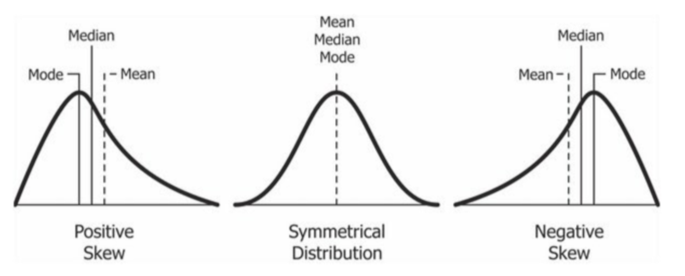
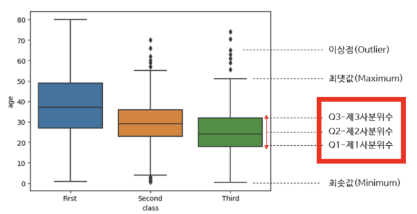
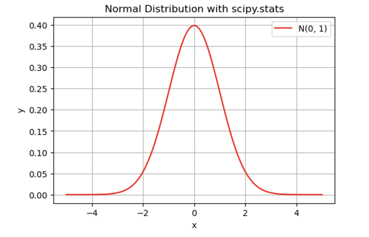
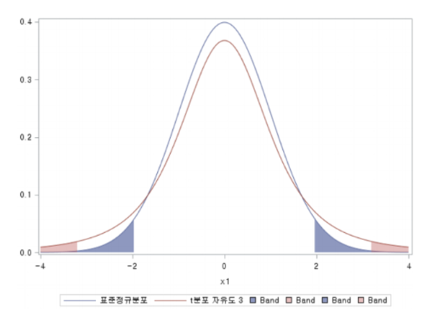
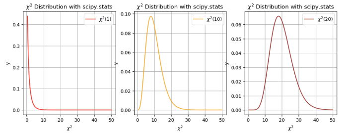
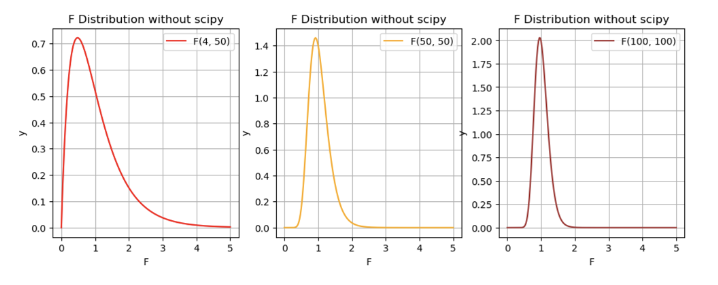
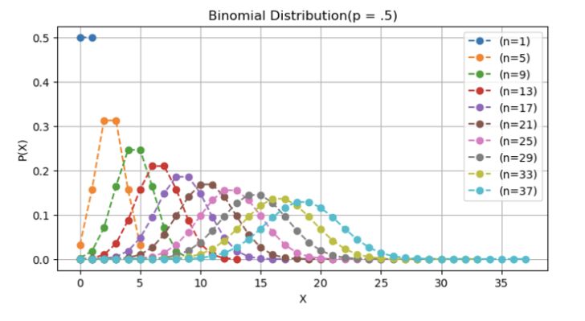
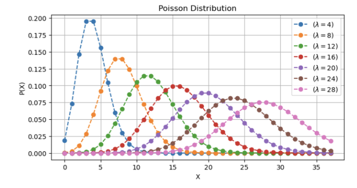
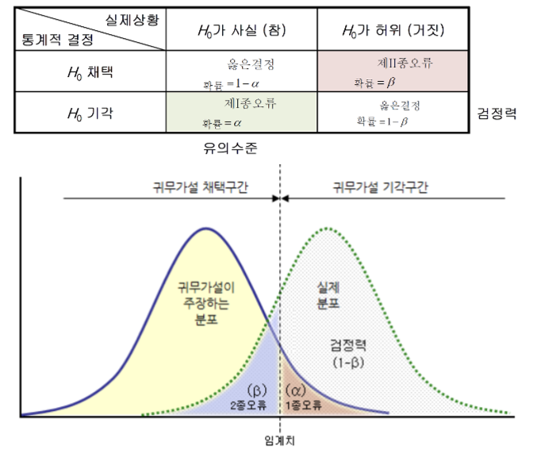

# 1. 통계란
+ **기술 통계학**
    + 데이터를 요약하고 기술하는 기법을 다루는 분야
    + 평균, 중앙값, 표준편차, 분포

- **추론 통계학**
    + 주어진 데이터를 기반으로 미래의 정보를 추론하고 결론을 도출하는 기법을 다루는 분야
    + 통계적 가설검정, 신뢰구간 

 

# 2. 수치 기술 통계 (기술 통계)
## 2.1 중심 위치 척도
+ **평균 (mean)**
    
    + 데이터 값의 총합을 데이터의 개수로 나눈 값으로 데이터의 중심 경향성을 나타냄
    
    + 이상치(outlier)에 민감할 수 있음
    
+ **중앙값 (median)**
    
    + 데이터 값들을 크기 순서대로 나열했을 때 가운데 위치한 값
    
    + 평균과 달리 이상치에 덜 민감하며, 데이터의 중심 경향성을 나타내는 대안적인 지표
    
+ **최빈값 (mode)**
    
    + 데이터에서 가장 자주 나타나는 값 
    
    + 주로 범주형 데이터에서 사용되며, 데이터의 분포를 이해하는데 도움을 줌
    
    

## 2.2 변동성 척도
+ **사분위수 (quartile)**
    
    + 데이터의 표본을 네 개의 동일한 부분으로 나눈 값을 의미 (n은 총 도수)
    
        + Q1 = 1+(n-1) x 0.25
        + Q2 = 중앙값
        + Q3 = 1+(n-1) x 0.75
+ **사분위간 범위 (IQR)**
    
    + Q3에서 Q1 값을 제외한 범위를 의미
    

- **범위 (range)**
    
    데이터의 최대값과 최소값의 차이를 나타내는 지표로, 데이터의 전체 변동 범위를 알려줍니다.
    
+ **분산 (variance)**
    
    + 데이터 값들이 평균으로부터 얼마나 멀리 퍼져있는지를 나타내는 측정 지표
    
    + 각 데이터 값과 평균 간의 편차(차이)를 제곱한 값들의 합
    
+ **표준편차 (standard deviation)**
    
    + 데이터 값들이 평균으로부터 얼마나 퍼져 있는지를 나타내는 중요한 통계적 지표.
    
    + 분산의 제곱근
    
+ **변동계수 (coefficient of variation)**
    
    + 데이터의 상대적인 변동성을 나타내는 통계적 지표
    
    + 표준편차를 해당 데이터의 평균으로 나눈 값
    
    + (변동계수(%) = 표준편차/평균 * 100)

## 2.3 연관성 척도
+ **공분산 (covariance)**
    
    + 두 변수가 각자의 평균으로부터 떨어진 값을 서로 곱한 후 평균한 값
    
    + 두 변수가 함께 어떤 방향으로 변화하는지와 그 크기를 표현하는데 사용됩니다.
    
        + Cov (X,Y) > 0이면 X와 Y는 양의 관계
        + Cov (X,Y) < 0이면 X와 Y는 음의 관계
        + Cov (X,Y) = 0이면 X와 Y는 양도 음도 아닌 관계
            + 관계가 없다고 해석해도 거의 무방하지만 아닌 반례도 있음
+ **상관계수 (correlation)**
    
    + 두 변수 간의 선형적인 관계를 나타내는 통계적 지표입
    
    + 상관계수는 -1과 1 사이의 값을 가지며, 상관관계와 인과관계는 다르다는 점을 주의
    
    + 공분산을 -1과 1사이로 표준화 한 것이므로 다음과 같이 해석
    
        + Corr (X,Y) = 1에 가까울수록 양의 상관관계 (1이면 완전한 양의 상관관계)
        + Corr (X,Y) = -1에 가까울수록 음의 상관관계 (-1이면 완전한 음의 상관관계)

 

# 3. 추론 통계 (모집단 분포 추정)
## 3.1 확률분포
+ **이산확률분포** 
+ **연속확률분포**
## 3.2 확률분포 예시
+ 정규분포

+ **T 분포**

+ **카이제곱분포**

+ **F 분포**

+ **이항분포 + 베르누이분포**

+ **포아송분포**

 

# 4. 가설 검정
## 4.1 가설 검정의 절차
**1. 가설 설정**
    
+ 귀무가설 H0와 대립가설 H1를 설정합니다.
+ 귀무가설은 주로 확인하기 용이하거나 기각하고자하는 명제로 설정합니다.  
-> 채택과 기각을 위해서는 판단 기준이 필요한데 그것을 **유의 수준**이라고 합니다.
        
**2. 유의 수준 설정**
+ 유의수준 : 얼마나 정해진 수치를 벗어나면 귀무가설이 오류라고 인정할 것인가를 판단하는 기준
+ 기호 : α
+ 신뢰 수준 : 1 - α 
+ α값이 커지면 대립가설이 채택될 가능성이 높아지며 이 값이 작아지면 대립가설이 기각될 가능성이 높아짐
    
**3. 검정통계량 산출**
+ 가설 검정의 결과를 판단하는 데 사용됨
+ 데이터가 분포나 특징에 따라 Z통계량, T통계량 등 어떤 검정통계량을 사용할지 정함
    
**4. 가설 기각/채택 판단**
+ 검정통계량이 확률분포 어디에 위치하느냐에 따라 기각 및 채택 여부가 결정되게 됨 
+ 검정통계량이 신뢰구간에 위치해 있을 때는 귀무가설 채택하고, 벗어날 시에는 귀무가설을 채택함  

+ 유의확률(p-value)도 가설검정에 사용됨 
+ 유의 확률 p-value가 유의 수준(α)보다 클 시에는 귀무가설을 채택하고, 작을 시에는 귀무 가설을 기각함

## 4.2 1종, 2종 오류
+ **1종 오류(𝛼)** : 귀무가설이 실제로 참이었는데 기각할 확률
+ **2종 오류(𝛽)** : 귀무가설이 실제로 거짓인데 채택할 확률

 

# 5. 조건부확률과 베이즈 정리
+ **조건부 확률(Conditional Probability)**
    + 어떤 사건이 일어났을 때, 그와 연관된 다른 사건이 일어날 확률을 의미
    
    + 보통 **P(B|A)**와 같이 표시하며, 이는 사건 A가 일어났을 때, 사건 B가 일어날 확률을 의미
    
+ **베이즈 정리 (Bayes' Theorem)**
    
    + 베이즈 정리는 의학, 인공지능, 경제학 등 다양한 분야에서 활용됨
    
    + 조건부 확률을 이용하여 사전 정보가 주어졌을 때 그 정보를 이용하여 새로운 정보를 추론하는 방법