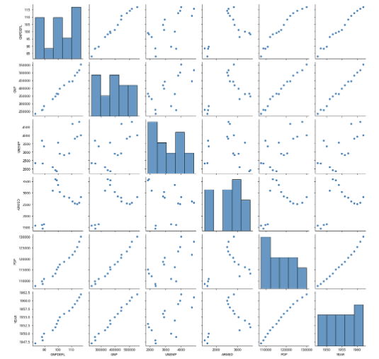
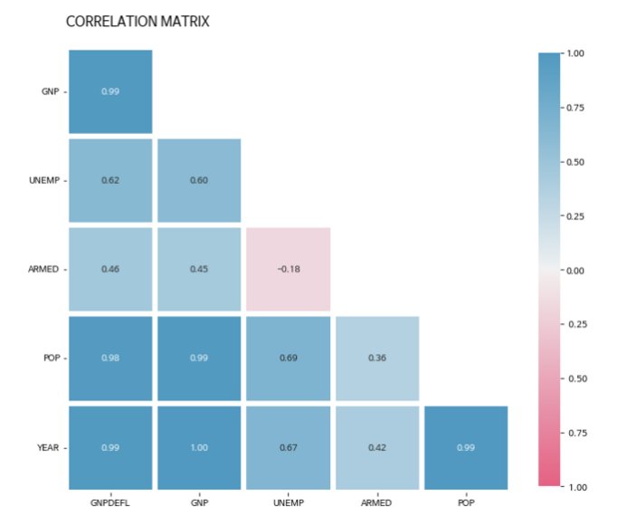

# 회귀, 분류, 군집화
## 1. 회귀
- 지도학습
- 둘 이상의 변수 간의 관계를 보여주는 통계적 기법
## 2. 분류
- 지도학습
- 기존에 존재하는 데이터의 관계를 학습하여 새롭게 관측된 데이터에 대한 결과를 스스로 판별하는 과정
## 3. 군집화
- 비지도 학습
- 주어진 데이터들의 특성을 고려해 같은 그룹(cluster)을 정의하고 그룹화하여 그룹의 대표성을 찾아내는 방법

<br>

# 선형회귀
- 실제 값과 예측값의 차이(오류의 제곱 값)를 최소화하는 직선형 회귀선을 최적화하는 방식
## 선형회귀분석의 목적
- 데이터의 이해
    - 과거 현상이 어떤 원인 때문에 발생했는지 밝혀내고 이해하는데 사용
    - 예) “기본금리 상승과 이자율 상승은 어떤 관계를 갖고 있는가”
- 예측(Prediction)
    - 과거의 데이터를 기반으로 모델을 형성하여 미래의 값을 예측
    - 예) “기본금리가 1%p 상승하면 코스피는 얼마나 증가 혹은 감소할지 예측”
- 인과관계 증명
    - 인과관계를 측정하고 추적하는 기능을 수행
    - 인과관계 측정: 다른 요인을 통제했을 때, 원하는 효과가 다시 반복적으로 나타는가를 확인
    - 인과관계 추적(증명): 종속변수의 변화를 독립변수의 변인에 귀속시킬 수 있는지 검증
## 단순선형회귀
- 연속형 반응 변수 $y$ 와 설명변수 $x$ 하나를 갖는 모형
## 다중선형회귀
- 연속형 반응(종속) 변수 하나에 설명(독립)변수가 둘 이상인 모인 모형을 말한다.

<br>

# 다중공산성
- 설명 변수들 간의 선형 종속이 심한 경우
    ⇒ 설명 변수들 간 정보의 중첩이 발생한 것으로 설명변수들 간에 높은 상관관계를 갖는 경우를 뜻함
## 다중공산성 확인 방법
- 산점도 그래프 그리기



-> 독립변수 간의 pair plot을 찍어보았을 때, 일부 변수 간의 플랏이 선형성을 띄는 것을 확인할 수 있다.
- 상관계수 확인



-> 상관계수를 확인해보았을 때 0.98 내지 1.00의 매우 높은 상관계수를 보이는 변수 집단 존재
- 분산팽창계수
```
vif = pd.DataFrame()
vif["VIF Factor"] = [variance_inflation_factor(dfX.values, i) for i in range(dfX.shape[1])]
vif["features"] = dfX.columns
vif
```

-> VIF가 5가 넘으면 다중공선성이 있다고 판단

## 다중공선성 대처 방법

- 변수 제거(변수 선택법)
    - 단, 변수 제거는 자료의 다양성을 해치고, 분석하려던 가설에 영향을 미칠 수 있기 때문에 가급적 자제하는 것이 좋음
- 변수 변환
    - 변수들을 더하거나 빼서 새로운 변수 생성
    - 독립변수를 더하거나 빼더라도 문제가 없는 경우
    - 예) 남편의 수입과 아내의 수입이 서로 상관성이 높다면, 두 개를 더해 가족 수입이라는 하나의 변수로 투입
- 규제 선형 모델 활용
    - 릿지, 라쏘, 엘라스틱넷 등의 방법을 통해 모델의 복잡도를 줄이는 방법 사용
- PCA

<br>

# 최소제곱법
- 최소자승법이라고도 함
- 오차를 최소화 시키는 방법으로 회귀 계수($\beta_0,\beta_1)$를 추정하는 기법
- $f(x)=\beta x+\alpha$
- $y_i=\alpha+\beta x_i+u_i$
- $\epsilon_i=y_i-f(x_i)$
- $\epsilon_i$(잔차): 표본에 의해 생긴 차이 (cf: $u_i$: 오차, 모집단에 의해 생긴 차이)
```
#x_bar(x평균), y_bar(y평균) 구하기
x_bar = x.mean()
y_bar = y.mean()

#w의 계수 찾기
calculated_weight = ((x - x_bar) * (y - y_bar)).sum() / ((x - x_bar)**2).sum()
print('w: {:.2f}'.format(calculated_weight))

#b의 계수 값 구하기
calculated_bias = y_bar - calculated_weight * x_bar
print('b: {:.2f}'.format(calculated_bias))
```